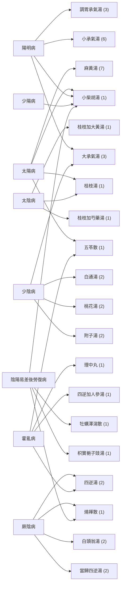

```mermaid
graph LR
  taiyang["太陽病"]
  taiyang --> f123["桂枝湯 (21)"]
  taiyang --> f3267["小柴胡湯 (13)"]
  taiyang --> f726["麻黃湯 (7)"]
  taiyang --> f8758["五苓散 (6)"]
  yangming["陽明病"]
  yangming --> f7115["大承氣湯 (16)"]
  yangming --> f6858["小承氣湯 (6)"]
  yangming --> f6124["調胃承氣湯 (3)"]
  yangming --> f3267["小柴胡湯 (3)"]
  shaoyang["少陽病"]
  shaoyang --> f3267["小柴胡湯 (2)"]
  taiyin["太陰病"]
  taiyin --> f123["桂枝湯 (1)"]
  taiyin --> f1155["桂枝加芍藥湯 (1)"]
  taiyin --> f8782["桂枝加大黃湯 (1)"]
  shaoyin["少陰病"]
  shaoyin --> f7115["大承氣湯 (3)"]
  shaoyin --> f4062["附子湯 (2)"]
  shaoyin --> f6483["桃花湯 (2)"]
  shaoyin --> f2612["白通湯 (2)"]
  jueyin["厥陰病"]
  jueyin --> f2309["四逆湯 (4)"]
  jueyin --> f163["當歸四逆湯 (2)"]
  jueyin --> f6476["白頭翁湯 (2)"]
  jueyin --> f6616["黃芩湯 (1)"]
  huoluan["霍亂病"]
  huoluan --> f2309["四逆湯 (2)"]
  huoluan --> f8849["四逆加人參湯 (1)"]
  huoluan --> f5028["理中丸 (1)"]
  huoluan --> f8758["五苓散 (1)"]
  laofu["陰陽易差後勞復病"]
  laofu --> f6616["燒褌散 (1)"]
  laofu --> f8363["枳實梔子豉湯 (1)"]
  laofu --> f3267["小柴胡湯 (1)"]
  laofu --> f545["牡蠣澤瀉散 (1)"]
```