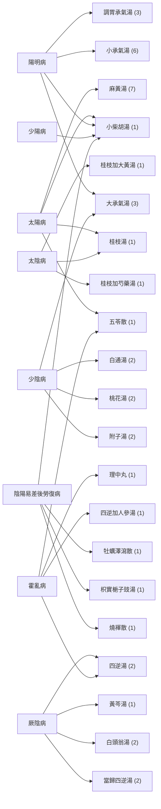

```mermaid
graph LR
  taiyang["太陽病"]
  taiyang --> f5499["桂枝湯 (21)"]
  taiyang --> f4569["小柴胡湯 (13)"]
  taiyang --> f8239["麻黃湯 (7)"]
  taiyang --> f6814["五苓散 (6)"]
  yangming["陽明病"]
  yangming --> f833["大承氣湯 (16)"]
  yangming --> f9074["小承氣湯 (6)"]
  yangming --> f2682["調胃承氣湯 (3)"]
  yangming --> f4569["小柴胡湯 (3)"]
  shaoyang["少陽病"]
  shaoyang --> f4569["小柴胡湯 (2)"]
  taiyin["太陰病"]
  taiyin --> f5499["桂枝湯 (1)"]
  taiyin --> f2439["桂枝加芍藥湯 (1)"]
  taiyin --> f6251["桂枝加大黃湯 (1)"]
  shaoyin["少陰病"]
  shaoyin --> f833["大承氣湯 (3)"]
  shaoyin --> f2322["附子湯 (2)"]
  shaoyin --> f5385["桃花湯 (2)"]
  shaoyin --> f5855["白通湯 (2)"]
  jueyin["厥陰病"]
  jueyin --> f5171["四逆湯 (4)"]
  jueyin --> f4494["當歸四逆湯 (2)"]
  jueyin --> f5353["白頭翁湯 (2)"]
  jueyin --> f8974["黃芩湯 (1)"]
  huoluan["霍亂病"]
  huoluan --> f5171["四逆湯 (2)"]
  huoluan --> f30["四逆加人參湯 (1)"]
  huoluan --> f2763["理中丸 (1)"]
  huoluan --> f6814["五苓散 (1)"]
  laofu["陰陽易差後勞復病"]
  laofu --> f1262["燒褌散 (1)"]
  laofu --> f371["枳實梔子豉湯 (1)"]
  laofu --> f4569["小柴胡湯 (1)"]
  laofu --> f1009["牡蠣澤瀉散 (1)"]
```