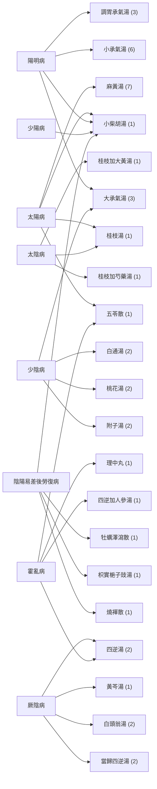

```mermaid
graph LR
  taiyang["太陽病"]
  taiyang --> f3958["桂枝湯 (21)"]
  taiyang --> f2522["小柴胡湯 (13)"]
  taiyang --> f3824["麻黃湯 (7)"]
  taiyang --> f4375["五苓散 (6)"]
  yangming["陽明病"]
  yangming --> f2231["大承氣湯 (16)"]
  yangming --> f5488["小承氣湯 (6)"]
  yangming --> f9573["調胃承氣湯 (3)"]
  yangming --> f2522["小柴胡湯 (3)"]
  shaoyang["少陽病"]
  shaoyang --> f2522["小柴胡湯 (2)"]
  taiyin["太陰病"]
  taiyin --> f3958["桂枝湯 (1)"]
  taiyin --> f7623["桂枝加芍藥湯 (1)"]
  taiyin --> f7869["桂枝加大黃湯 (1)"]
  shaoyin["少陰病"]
  shaoyin --> f2231["大承氣湯 (3)"]
  shaoyin --> f803["附子湯 (2)"]
  shaoyin --> f2323["桃花湯 (2)"]
  shaoyin --> f3510["白通湯 (2)"]
  jueyin["厥陰病"]
  jueyin --> f1401["四逆湯 (4)"]
  jueyin --> f9350["當歸四逆湯 (2)"]
  jueyin --> f8861["白頭翁湯 (2)"]
  jueyin --> f8538["黃芩湯 (1)"]
  huoluan["霍亂病"]
  huoluan --> f1401["四逆湯 (2)"]
  huoluan --> f6508["四逆加人參湯 (1)"]
  huoluan --> f8289["理中丸 (1)"]
  huoluan --> f4375["五苓散 (1)"]
  laofu["陰陽易差後勞復病"]
  laofu --> f1773["燒褌散 (1)"]
  laofu --> f3626["枳實梔子豉湯 (1)"]
  laofu --> f2522["小柴胡湯 (1)"]
  laofu --> f85["牡蠣澤瀉散 (1)"]
```